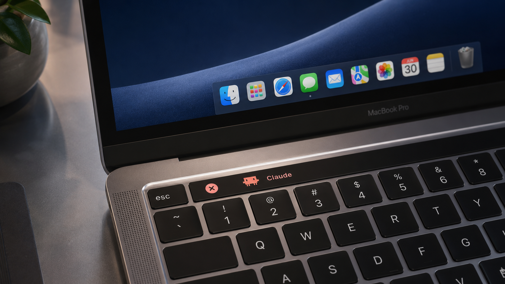

# Touch Claude

让 Claude Code 住进 Touch Bar，变成一只会饿、会累、需要吃饭和睡觉的本地电子宠物。每当 Claude 成功回答完一个问题，小人会跳两下；这次回答以及它调用的 subagent 所消耗的 token，会转化为宠物的饥饿和体力消耗。



这是一个纯本地 MVP：没有账号、充值和云同步，也不会上传对话或宠物数据。每天前三次成功喂食免费；免费次数用完后，付费食物暂未实现。

## 玩法

- 初始属性：健康 100、饥饿 20、体力 100，年龄从孵化时间开始计算。
- Touch Bar 常驻显示 `♥健康  🍖饥饿  ⚡体力`；每次回答完成时先结算 token、刷新三个指标，再跳两下。
- 一次成功的用户问题只结算一次工作事件并跳两下；用户中断或失败的 API 请求不结算。subagent token 会计入父问题，但不会额外触发跳跃。
- 每次 `feed` 降低 30 点饥饿，每个本地自然日前三次成功喂食免费。饥饿低于 10 时会拒绝喂食，且不消耗免费次数。
- 清醒时饥饿每小时增加 0.5、体力每小时减少 2；睡眠时饥饿每小时增加 0.25、体力每小时恢复 12.5。
- `sleep` 最多持续八小时后自动醒来。Mac 睡眠以及应用没有运行的时间按宠物睡眠计算。
- 饥饿达到 100 后进入挨饿状态，每小时损失 2 点健康，及时喂食仍可救回。
- 连续清醒超过 20 小时、体力长期为 0，或超过 36 小时没有完成工作，都会逐渐损失健康。
- 健康降到 0 后死亡；死亡后只能运行 `clawd hatch` 重新开始，最长寿命会保留。

### Token 如何影响宠物

一次问题的有效 token 工作量按下式计算：

```text
E = output
  + 0.20 × uncached_input
  + 0.25 × cache_creation
  + 0.02 × cache_read
```

每 30,000 有效 token 增加 1 点饥饿，每个本地自然日最多由 token 增加 150 点饥饿。工作量越大，消耗的体力越多；单次消耗在 0.5～8 之间。体力充足时，每次成功工作还会恢复 0.5 健康，每日最多恢复 3 点。

Touch Claude 只从本机 Claude Code transcript 中读取 prompt/session 标识和 token 计数，用于去重和结算；不会保存或上传问题、回答正文。
异步 subagent 的 token 可能在小人跳完后才写入 transcript；helper 会在接下来约一分钟内增量补算，但不会因此再次跳跃。

## 安装

需要一台带 Touch Bar 的 MacBook Pro，并将 `系统设置 → 键盘 → 触控栏 → 触控栏显示` 设为“App 控制”。

```bash
./scripts/install_launch_agent.sh
```

安装脚本会：

1. 编译并安装后台 helper 和 `clawd` 命令；
2. 安装开机自启的 LaunchAgent；
3. 写入 Claude Code `Stop` hook，并自动备份 `~/.claude/settings.json`；
4. 将旧版只负责触发动画的 poke hook 原位升级为宠物结算 hook，同时保留其他 hooks。

安装后请新开一个 Claude Code 会话，让新的 hook 生效。

## 命令

```bash
clawd status                 # 查看年龄、健康、饥饿、体力和今日免费喂食次数
clawd feed                   # 喂食：饥饿 -30，每天前三次成功喂食免费
clawd sleep                  # 让宠物睡觉；不会隐藏 Touch Bar
clawd wake                   # 提前叫醒宠物
clawd hatch                  # 宠物死亡后重新孵化
clawd view show              # 始终显示 Touch Bar 宠物
clawd view hide              # 隐藏 Touch Bar 宠物
clawd view auto              # 跟随 Claude Code 进程自动显示或隐藏
```

玩家不能手动执行 jump。`_record-stop` 是 Claude Code hook 使用的内部命令，不属于公开玩法。

## 本地测试

```bash
# 运行确定性的规则、持久化和 token 聚合测试
./scripts/test.sh

# 编译生产 helper
./scripts/build.sh
```

完成安装后的冒烟测试：

```bash
clawd view show
clawd status
```

然后在新开的 Claude Code 会话里问一个问题。回答完成时小人应跳两下，随后再次运行 `clawd status`，确认工作次数、token、饥饿和体力只结算一次。

## 卸载

```bash
./scripts/uninstall_launch_agent.sh
```

卸载脚本会先从 Claude Code 设置中移除新旧两种 Touch Claude Stop hook，再停止 LaunchAgent、删除 helper 和它安装的 `clawd` 链接。其他 Claude Code hooks 不会受影响。

宠物状态与日志默认保留在 `~/.claude-touchbar/`，因此重新安装后可以继续。这个本地 MVP 暂不提供充值，且本地状态不具备防作弊能力。

## 项目结构

```text
Touch-Claude/
├─ Sources/        Swift + AppKit helper、宠物规则和 CLI
├─ Tests/          本地确定性测试
├─ scripts/        构建、测试、安装与卸载脚本
├─ docs/           设计文档
└─ assets/         像素小人与展示图片
```
